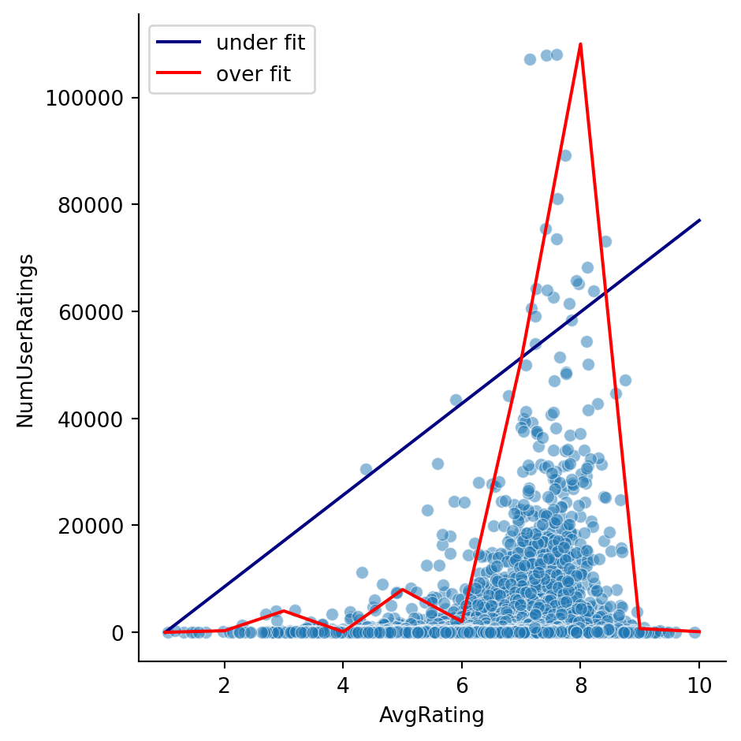
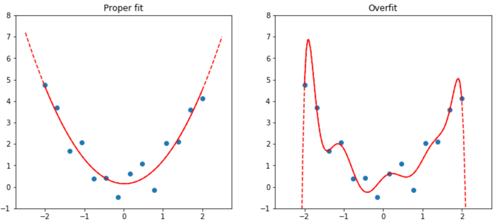
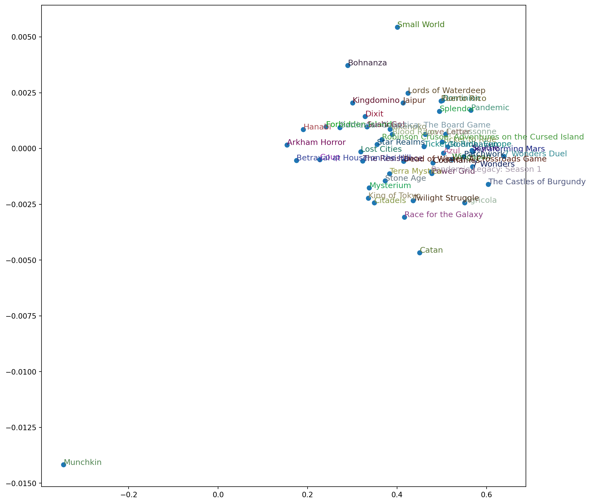

<script src="https://cdnjs.cloudflare.com/ajax/libs/require.js/2.3.6/require.min.js" integrity="sha512-c3Nl8+7g4LMSTdrm621y7kf9v3SDPnhxLNhcjFJbKECVnmZHTdo+IRO05sNLTH/D3vA6u1X32ehoLC7WFVdheg==" crossorigin="anonymous"></script>
<script src="https://cdnjs.cloudflare.com/ajax/libs/jquery/3.5.1/jquery.min.js" integrity="sha512-bLT0Qm9VnAYZDflyKcBaQ2gg0hSYNQrJ8RilYldYQ1FxQYoCLtUjuuRuZo+fjqhx/qtq/1itJ0C2ejDxltZVFg==" crossorigin="anonymous"></script>
<script type="application/javascript">define('jquery', [],function() {return window.jQuery;})</script>


## Intro

Recommendation systems are one of the applications of machine learning that have become so embedded in daily life that it can be surprising to consider them as even related to machine learning. Nonetheless, looking at their internals provides a good scaffolding to use for more advanced topics.

Netflix, Amazon, and Spotify all have suggested shows, products, and songs for their users. Though the recommended items are all different, all share the same origin of being generated by a process called 'collaborative filtering'. The essence of it boils down to three steps: identify the things you used or liked, find other users who used or liked the same things, and suggest things that the other users used or liked. Notably, the process doesn't rely on user data entry or any manual assignment of categories for recommendations. Instead, what's happens is the attribution of **latent factors** to users and items. These are numerical representations of the strength of the many and varied motivations behind user ratings and selections. Similarly, the recommendations have corresponding numbers that represent how well they fit those criteria.

## Example: boardgame ratings

To make things less abstract let's use an example based on [a dataset of boardgames](https://www.kaggle.com/datasets/threnjen/board-games-database-from-boardgamegeek) from BoardGameGeek that's been uploaded to Kaggle. Once downloaded, it provides 9 files total but let's just use two to start with, giving us some basic data about board games and users.

``` python
from fastai.collab import *
from fastai.tabular.all import *
from pathlib import Path
# import zipfile

# zipdata = zipfile.ZipFile('boardgamegeek.zip')
# zipdata.extractall(path='./data')
# zipdata.close()
gamepath = Path('./data/games.csv')
games = pd.read_csv(gamepath)
subset = ['Name', 'YearPublished', 'Kickstarted', 'NumUserRatings']
games[subset].head()
```

<div>
<style scoped>
    .dataframe tbody tr th:only-of-type {
        vertical-align: middle;
    }

    .dataframe tbody tr th {
        vertical-align: top;
    }

    .dataframe thead th {
        text-align: right;
    }
</style>

|     | Name           | YearPublished | Kickstarted | NumUserRatings |
|-----|----------------|---------------|-------------|----------------|
| 0   | Die Macher     | 1986          | 0           | 5354           |
| 1   | Dragonmaster   | 1981          | 0           | 562            |
| 2   | Samurai        | 1998          | 0           | 15146          |
| 3   | Tal der Könige | 1992          | 0           | 340            |
| 4   | Acquire        | 1964          | 0           | 18655          |

</div>

The games.csv file contains much more metadata than we need right now so this is just a subset. As for the users, it's nothing more than pairing game and user ids along with a rating.

``` python
users = pd.read_csv('./data/user_ratings.csv').sample(200000, random_state=33)
users.head()
```

<div>
<style scoped>
    .dataframe tbody tr th:only-of-type {
        vertical-align: middle;
    }

    .dataframe tbody tr th {
        vertical-align: top;
    }

    .dataframe thead th {
        text-align: right;
    }
</style>

|          | BGGId  | Rating | Username            |
|----------|--------|--------|---------------------|
| 12789017 | 26244  | 6.0    | greetingsfrombergen |
| 8773357  | 139030 | 7.0    | mcloud357           |
| 10830810 | 97207  | 9.0    | AShottInTheDark     |
| 8601131  | 282524 | 8.0    | HawkOwlGaming       |
| 10636182 | 176396 | 8.0    | kentias             |

</div>

## An intuitive overview of the process

How does a machine understand if you like something and by how much? First by converting the terms of the discussion into numbers. Suppose we are considering Risk, the classic game of war and conquest, with 31510 ratings in the dataset.

``` python
games.query('Name == "Risk"')[subset]
```

<div>
<style scoped>
    .dataframe tbody tr th:only-of-type {
        vertical-align: middle;
    }

    .dataframe tbody tr th {
        vertical-align: top;
    }

    .dataframe thead th {
        text-align: right;
    }
</style>

|     | Name | YearPublished | Kickstarted | NumUserRatings |
|-----|------|---------------|-------------|----------------|
| 159 | Risk | 1959          | 0           | 31510          |

</div>

Users who rated it may have been considering any number of aspects they encountered while playing Risk, such as theme, playtime, complexity, and newness. Risk delivers fairly well on the theme of war, its playtime can be short as well as long, has low complexity in its rules, and is an old title. We could assign numbers between -1 and 1 to each of these like so:

``` python
risk = np.array([0.7,0.5,0.3,-0.6])
```

Similarly, a user might have a low interest in war games, be short on free time, prefers simplicity, and enjoys newer games. They could be assigned these numbers:

``` python
user1 = np.array([-.8,0.2,-0.5,0.6])
```

Collaborative filtering recommends items to users if the match between them is high, and it determines this by multiplying the arrays and adding up the result:

``` python
(user1 * risk).sum()
```

    -0.97

The operation is referred to as a **dot product** and the arrays of numbers are the latent factors. In this case the -0.97 indicates a poor match. Someone with the opposite preferences would yield a higher number and thus be recommended Risk.

The latent factors in our example were arbitrarily selected (both the array lengths and array values), but in practice machine learning doesn't start any differently--the process initializes from random weights and refines them as the model learns.

## Setting up

To start, we need to put the data into a `dataloader`, which is a fastai feature that helps with the creation of mini-batches for iteration during machine learning, and identify some constants: the number of users and games in the dataset. We arbitrarily pick 9 as the number of factors to train for.

``` python
ratings = users.merge(games)
dls = CollabDataLoaders.from_df(ratings, item_name='Name', rating_name='Rating', user_name='Username')
n_users  = len(dls.classes['Username'])
n_games = len(dls.classes['Name'])
n_factors = 5
```

The next step is to create **one-hot encodings**: these are tensors that are mostly zeros except at one index, and they will represent categorical data about the boardgames, such as theme and year of release. Furthermore, it needs to be able to be passed as arguments to parameters.

``` python
def create_params(size):
    return nn.Parameter(torch.zeros(*size).normal_(0, 0.01))
```

## The main components of the model

The model will be trained by using dot products on the users and boardgames but there are additional pieces that improve its performance.

### Bias

One of the most relatable is bias. We all know people who think everything they try is the most amazing thing ever. Conversely, some people find flaws in everything. Adding additional tensors of equal size will prevent these kinds of ratings from distorting the machine learning model.

``` python
class BoardGameRecs(Module):
    def __init__(self, n_users, n_games, n_factors, y_range=(0,10.5)):
        self.user_factors = create_params([n_users, n_factors])
        self.user_bias = create_params([n_users])
        self.game_factors = create_params([n_games, n_factors])
        self.game_bias = create_params([n_games])
        self.y_range = y_range

    def forward(self, x):
        users = self.user_factors[x[:,0]]
        games = self.game_factors[x[:,1]]
        res = (users * games).sum(dim=1)
        res += self.user_bias[x[:,0]] + self.game_bias[x[:,1]]
        return sigmoid_range(res, *self.y_range)
```

### Weight decay

Weight decay is modification of the loss function every time it is calculated, simply adding a large constant, the intent of which is to counteract overfitting. Making the loss function grow bigger is counterproductive in the short run, since it extends training time, but the tradeoff is worth it.

But how does simple addition prevent overfitting? Consider a plot of an overfitted loss function:

``` python
import seaborn as sns
import matplotlib.pyplot as plt
sns.relplot(games, x='AvgRating', y='NumUserRatings', alpha=.5)
plt.plot([1, 10], [0, 77000], label='under fit', color='navy')
plt.plot(range(1,11), [13, 300, 4000, 100, 8000, 2000, 51000, 110000, 700, 123], label='over fit', color='red', scaley='log')
plt.legend(loc="upper left")
plt.show()
```



When models are underfit, the loss function can take a wildly inaccurate and straight path. Overfit models, on the other hand, tend to zigzag as they try to adhere to data points. The scatterplot above is from some of the omitted columns in the boardgame dataset that's been overlaid with cherry-picked numbers to illustrate, but this example also shows the zigzag pattern:


Next, consider that quadratics such as



$$ax^2+bx+c$$

get steeper and narrower as *a* and *b* grow larger. Weight decay leverages this effect so that the resulting trained weights (which want to go in the opposite direction of this line) do not overfit.

### What is `forward` and `x`?

The `forward` function allows pytorch to send arguments to other method calls. The model input is a tensor of shape `[batch_size, 2]`, where the first column is user ids (x\[:,0\]) and the second column game ids (x\[:,1\]).

## Results

Now we can look at some training results at 5 epochs.

``` python
model = BoardGameRecs(n_users, n_games, n_factors)
learn = Learner(dls, model, loss_func=MSELossFlat())
learn.fit_one_cycle(5, 5e-3, wd=0.5)
```

<style>
    /* Turns off some styling */
    progress {
        /* gets rid of default border in Firefox and Opera. */
        border: none;
        /* Needs to be in here for Safari polyfill so background images work as expected. */
        background-size: auto;
    }
    progress:not([value]), progress:not([value])::-webkit-progress-bar {
        background: repeating-linear-gradient(45deg, #7e7e7e, #7e7e7e 10px, #5c5c5c 10px, #5c5c5c 20px);
    }
    .progress-bar-interrupted, .progress-bar-interrupted::-webkit-progress-bar {
        background: #F44336;
    }
</style>

| epoch | train_loss | valid_loss | time  |
|-------|------------|------------|-------|
| 0     | 3.809083   | 3.860057   | 00:14 |
| 1     | 3.789457   | 3.782172   | 00:14 |
| 2     | 3.883043   | 3.765205   | 00:15 |
| 3     | 3.741912   | 3.742835   | 00:15 |
| 4     | 3.636702   | 3.736580   | 00:15 |

When we discussed the concept of biases for machine learning, it was with users as an example, but it applies to the boardgames in our dataset as well. Instead of perpetual critical reviews or excess praise, we have consistently high ratings even if the user isn't supposed to be a good match for the game, and consistently low ratings even if the user should like it.

``` python
game_bias = learn.model.game_bias.squeeze()
idxs = game_bias.argsort()[:5]
[dls.classes['Name'][i] for i in idxs]
```

    ['Chutes and Ladders',
     'Monopoly',
     'Tic-Tac-Toe',
     'Candy Land',
     'The Game of Life']

Here we see some classic boardgames that have fallen out of favor with BoardGameGeek users: Tic-Tac-Toe, Chutes and Ladders, Candy Land. Even users who prefer simple and light boardgames want to play alternatives to these.

``` python
idxs = game_bias.argsort(descending=True)[:5]
[dls.classes['Name'][i] for i in idxs]
```

    ['Terraforming Mars', '7 Wonders Duel', 'Scythe', '7 Wonders', 'Wingspan']

And at the other end of the spectrum are Gloomhaven and Pandemic, the boardgame equivalent of blockbuster movies. These are well-liked by all users even if they don't typically enjoy intricate turn-based combat (Gloomhaven) or cooperative games (Pandemic).

This is a preview of a future post but warrants showing here since computing cycles have already been used to train the model. The following chart uses two of the model's factors as axes, to which are ploted some of the highest rated boardgames.



There are clusters that have formed organically just from user ratings and their positions on the plot represent potential quadrants relating to the boardgame characteristics or themes.

## Further reading

A great post on the broader context of fitting categorical data into machine learning models, which the one-hot encoding used here is a part of, can be found here: https://www.featureform.com/post/the-definitive-guide-to-embeddings
